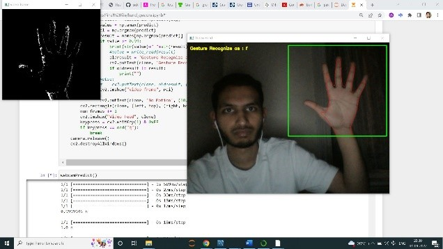
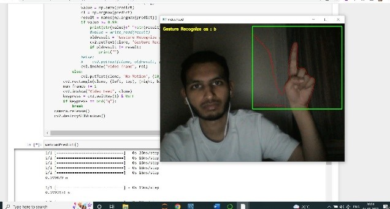
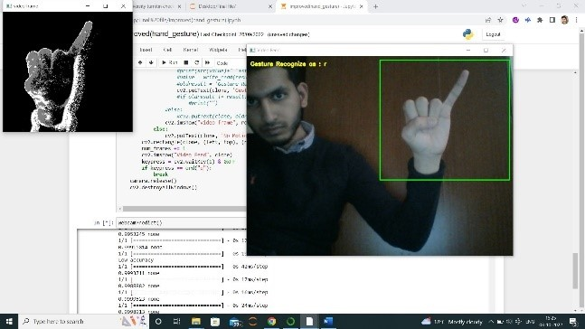
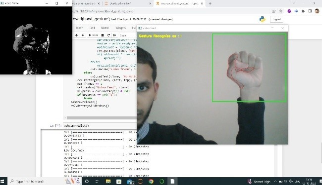
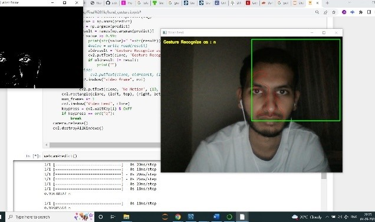
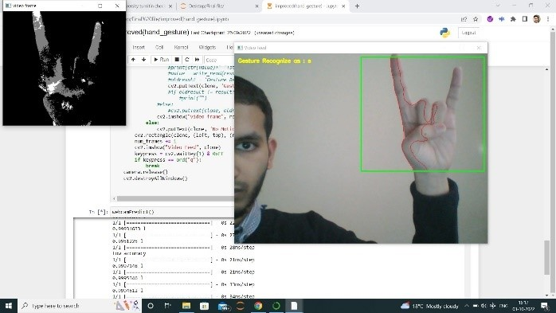

# Controlling-movements-of-mobile-robot-via-hand-gestures-using-CNN
The directions of a mobile robot controlled via hand gestures shwon to the camera using deep learning neural networks using CNN
* The mobile robot used in this projet

* Using dataset_creation.ipynb a ataset of 6000 images is created in a few seconds, 6 classes (Forward, Backward, Right, Left, Stop and No-motion) in the dataset. Out of
6000 images, 1000 belongs to each of the 6 classes. As can be seen below, the dataset in use
has been gone through image pre-processing in order to get high accuracy. 
 

    
  
  
  
  
  

*  In train folder, 6000 images are stored and in test folder 20% of the total train images are
stored in the same pattern as in train folder.

* The dataset images size is converted to 62x62 pixels for both train and test images.
* The chosen method for this project is CNN (Convolutional Neural Network) as it is a
technique which does not require image pre-processing and external feature extraction
methods to give high accuracy. Repeated layers of Conv2D and Max Pooling layers are used
in order to increase accuracy of the model followed by two Dense layers at the end of the
architecture which are responsible for classification and the initial layers acts as feature
extractors. The training time took was under 10 minutes which is a milestone for CNN, as
CNN takes long time for training, all thanks to the special images (image pre-processing
done: background eliminated, RGB to GRAY, Gaussian Blur, Eroded). The system managed to
achieve a very high accuracy of 99%+. 

### Programming the Arduino
Using pins 5, 10 for the right motor and 6, 9 for the left motor, programming is done on Arduino and functions for forward, backward, left, right, stop, no-motion directions is made. When a message from the python script sends Arduino any message, one of the stated functions will run. 
### Linking Python script to Arduino
Python script is linked to the Arduino board through serial. Serial is an important element when it comes to establish connection between Arduino and a computer or other devices. Pyserial module is a pre-requisite for serial. Pyserial is installed in python and program for sending data to the Arduino through serial is written in the python script. We must also first determine which COM Port the Arduino is on in order to connect it to Python. The baud rate is set at 9600 both in Python and Arduino.

### Result and tesing
The results can be seen below on each hand gesture shown in the camera
 

  1) Using proposed model, the hand gesture shown in the below figure is recognized as an ‘f’ which corresponds to ‘Forword’ motion. This hand gesture is trained as ‘Forward’ in the CNN model, and hence python will send this as ‘f’ value to the Arduino which will execute forward motion. With this instruction the robot will start moving in forward direction.   
    
  2) The below gesture is recognized as a ‘b’, which is ‘Backward’ motion. Python will send Arduino a message as a ‘b’, which will make the robot move in backward direction.  
    
  3) The below gesture is recognized as a ‘r’, which is ‘Right’ motion. Python will send Arduino a message as a ‘r’, which will make the robot move in right direction.  
    
  4) The below gesture is recognized as a ‘l’, which is ‘left’ motion. Python will send Arduino a message as a ‘l’, which will make the robot move in left direction.  
    
  5) When there is no gesture shown in front of the webcam, then

the recognized hand gesture is ‘No Motion’ based on the trained model. The message sent to the Arduino from Python is ‘n’ and the robot does not move in any direction. To get this type of prediction, image dataset with stable background, with human face, etc. were trained.

  
    
  6) As stop is very essential in the robot movements, hand gesture is chosen wisely such that it works all the time. Using proposed model, the hand gesture shown in the above figure is recognized as an ‘s’ which corresponds to ‘Stop’ motion. This hand gesture is trained as ‘Stop’ in the CNN model, and hence python will send this as ‘s’ value to the Arduino which will stop any motion. With this instruction the robot will start stop immediately.    
    

* The total dataset of 5966 pre-processed images were deployed into CNN, the images were resized to 64x64 and converted into batches of 32 images. The dataset was split into test set and train set, 90% as train dataset and 10% as test dataset. Over numerous epochs, the designed networks were repeatedly trained. The network was trained for 25 epochs. The training time for 5966 images was just under 10 minutes. Hand gesture is shown in a webcam for prediction result, before prediction the gesture obtained from webcam is converted to grayscale and all the pre-processing techniques, background subtraction techniques are applied as well. The trained network was accurately predicting the hand gesture with 99.4% accuracy as shown in the figure 10. 
Also, a 5966 raw image dataset without any image pre-processing applied was also fed into the CNN with a batch size of 32. The training time took for CNN was 37.5 minutes with a classification accuracy of 93.66% accuracy. 
The same raw dataset was tested with Random Forest classifier, images processing applied before classification, the accuracy with these traditional machine learning methods were lower in comparison with CNN and high rate of prediction error. Random forest classifier was recorded at 70% accuracy.
A n experimental analysis was also done with CNN, training CNN network with a very limited dataset of approximately 100 images in each of the 6 classes. The experiment achieved a milestone by giving 98% accuracy as it is a well-known fact that deep learning often requires large amount of data to perform well and does not perform at its peak in limited dataset scenarios [22]. 

* During testing, multiple jerk movements were recorded as the robot car was only moving when a hand gesture is shown in the camera and remained at stop (No-motion) position when the camera window was empty. However, the system was trying to pick some predictions even though when the region of interest (camera window) was empty resulting in random movements of the robot car. In order to eliminate these jerky movements, some modifications in the system are made, such that the robot will move in a direction as per the shown hand gesture and will continue to move in the same direction even when the hand is removed from the camera widow (as it was supposed to be at stopped position before) until unless a different type hand gesture is shown in the camera window which will result in the change of direction as per the other shown hand gesture. A timer of 3 seconds is also set upon each movement, which will limit each movement of the robot to only 3 seconds. The model was also made more sophisticated by instructing it to accept only gestures with high prediction accuracy more than 99.4%, any gestures having accuracy lower than this will not be recognized and avoided by the system.

### Conclusion
Proposed modified CNN model performs superior compared to state of art technique such as random forest machine learning classifier for controlling movement of robot car. Robot car move in five different directions based on five different gestures and one is ‘No Motion’ gesture. Modified CNN algorithm gives 99.4 % prediction accuracy while random forest classifier gives only 70% accuracy of real time hand gestures through webcam. A few developments also implemented to make the robot movements smooth and eliminate the jerkiness. An experimental analysis was also done by training the CNN with a very small dataset and achieved high accuracy. 
In future work, proposed work can be extended to complete real time application using Raspberry pi controller. GPS and some more sensors can be added to get location, environment details. Even obtained results can be published on private cloud. The mobile robot could also be made wireless by adding Bluetooth modules such as HC-05, HC-06 or else HC-12 if long distance connectivity is required. The intelligence of the mobile robot can also be advanced to object detection using an ultrasonic sensor. The only limitation of this model is that it performs at its peak with the show of stable hand gestures. 
